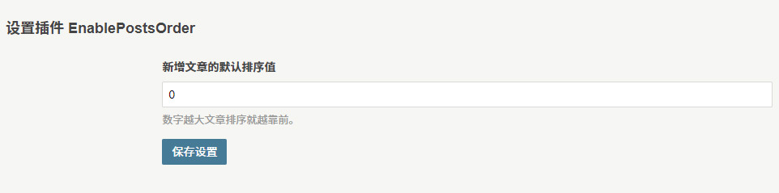
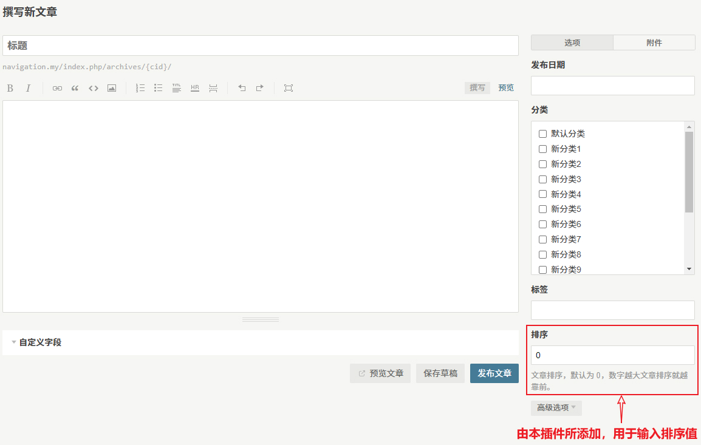
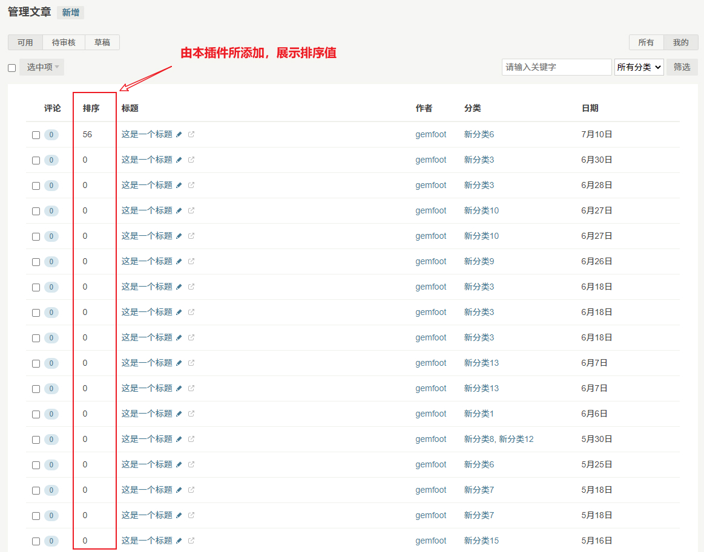

# EnablePostsOrder

> Typecho Plugin

## 简介

这是一个用于 Typecho 博客程序的插件，为文章增加手动排序的功能。

## 界面预览

- 插件设置界面

- 文章编辑界面

- 管理文章界面

## 安装需求

- Typecho 版本 >= 1.2.0

## 安装方法

1. 前往 [Releases](https://github.com/LightAPIs/EnablePostsOrder/releases/latest) 下载插件压缩包文件。
2. 解压所下载的插件压缩包文件，得到 `EnablePostsOrder` 目录，将其上传至服务器 Typecho 插件安装目录 `/usr/plugins/`。
3. 在浏览器里打开 Typecho 后台插件管理页面(默认：`/admin/plugins.php`)，启用该插件即可。

## License

[GPL-3.0](./LICENSE) license
